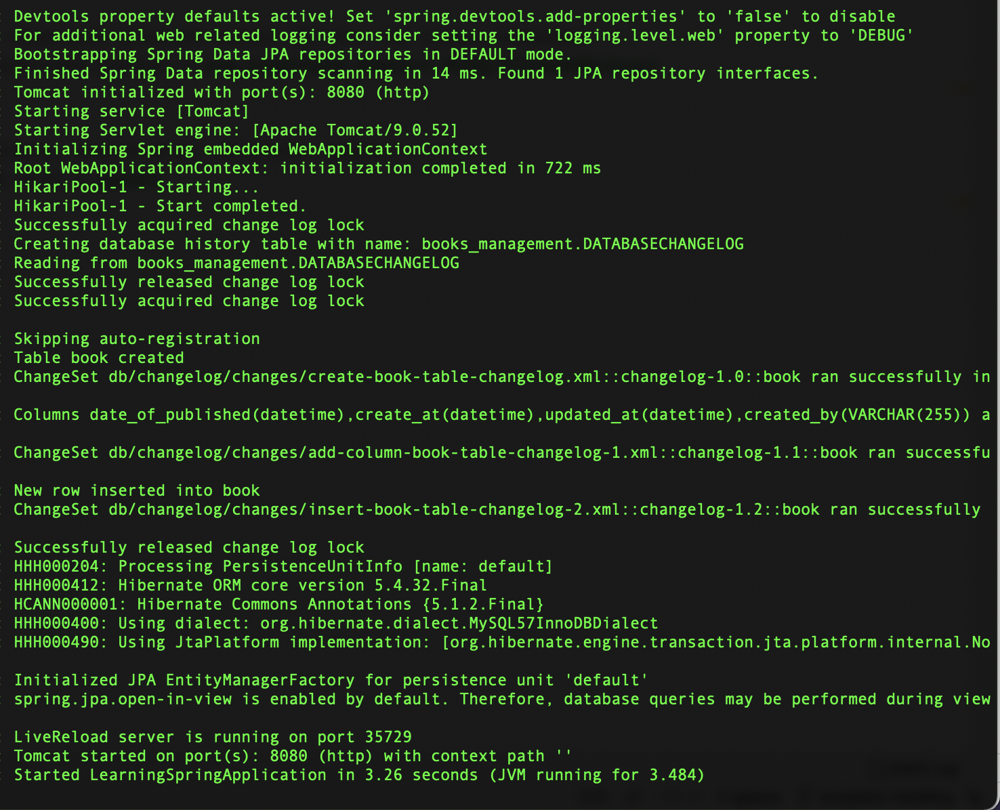

### Learning Spring Boot
Contents:
- [x] CRUD Operation
- [ ] Exception handling & Validation
- [ ] Liquibase Migration

#### 1. CRUD RESTFul APIs
Create the REST APIs for creating, retrieving, updating and deleting a Book

<details>
<summary>Click to view CRUD</summary>

##### Dependencies

> Spring Web \
> Spring Data JPA \
> MySQL Driver \
> Spring Boot DevTools

##### Configuring MySQL Database

src/main/java/resources/application.properties
```

## Spring DATASOURCE (  DataSourceAutoConfiguration & DataSourceProperties)
spring.datasource.url = jdbc:mysql://localhost:3306/book_management?useSSL=false
spring.datasource.username = hive
spring.datasource.password = letmein

## Hibernate Properties
# The SQL dialect makes Hibernate generate better SQL for the chosen database
spring.jpa.properties.hibernate.dialect = org.hibernate.dialect.MySQL57InnoDBDialect


# Hibernate ddl auto (create, create-drop, validate, update)
spring.jpa.hibernate.ddl-auto = update

```
##### Create a Controller Package
Create a new package controller inside `com.example.learningspring`. Then, create a new class BookController

##### Create a Model Package
Create a new package model inside `com.example.learningspring`. Then, create a new class Book

##### Create a Model Class
Right click on the `model` package then
New -> Java Class -> Enter the Class Name
<!---
Once created the model class then select filed like,
```
private long id;
private String title;
private String authorName;
private String description;
private Boolean published;
```
##### Auto Generate setter and getter

THEN Right click on the inside the base package `Book model class` -> Select -> Generate setter and getter -> Select fields
--->
##### Create BookRepository to access data from the database
* Create a new package called repository inside the base package com.example.learningspring.
* Then, create an interface called `BookRepository` and extend it from JpaRepository.
```
package com.example.learningspring.repository;

import org.springframework.data.jpa.repository.JpaRepository;

import com.example.learningspring.model.Book;

public interface BookRepository extends JpaRepository<Book, Long> {
}

```
Then Spring Data JPA will generate implementation code for the most common CRUD operations – we don’t have to write a single query.

##### Book Service Class
Next, code a class that acts as a middle layer between persistence layer (repository) and controller layer. Create the `BookService` class with the following code:
```
package com.example.learningspring.service;


import com.example.learningspring.repository.BookRepository;
import org.springframework.beans.factory.annotation.Autowired;
import org.springframework.stereotype.Service;
import com.example.learningspring.model.Book;

import java.util.List;

import javax.transaction.Transactional;

@Service
@Transactional
public class BookService {

  @Autowired
  private BookRepository service;

  public List<Book> listAll() {
    return service.findAll();
  }

  public Book save(Book book) {
    return service.save(book);
  }

  public Book update(Book bookData, Book book) {
    bookData.setTitle(book.getTitle());
    bookData.setAuthorName(book.getAuthorName());
    bookData.setDescription(book.getDescription());
    bookData.setPublished(book.getPublished());
    return service.save(bookData);
  }

  public Book get(Long id) {
    return service.findById(id).get();
  }

  public void delete(Long id) {
    service.deleteById(id);
  }
}

```
##### RESTful API Endpoints

1. Create a Book

The following method a RESTful API that allows the clients to create a book.

Code:
```
 @PostMapping(value = "books")
  public ResponseEntity<Book> createBook(@RequestBody Book book) {
    Book _book = service.save(new Book(book.getTitle(), book.getAuthorName(), book.getDescription(), false));
    return new ResponseEntity<>(_book, HttpStatus.CREATED);
  }
```

Endpoint:
```
POST  http://localhost:8080/api/v1/books
```
Response:

```json
[
    {
        "id": 11,
        "title": "Spring Boot",
        "authorName": "Pivotal Team",
        "description": "Spring Boot is an open source Java-based framework used to create a micro Service",
        "published": false
    }
]
```

2. List all books
This method that returns a list of book (a kind of retrieval operation).

Code:
```
 @GetMapping(value = "books")
  public List<Book> getAllBooks(){
    return service.listAll();
  }
```

Endpoint:
```
GET  http://localhost:8080/api/v1/books
```
Response:
```json
[
    {
        "id": 11,
        "title": "Spring Boot",
        "authorName": "Pivotal Team",
        "description": "Spring Boot is an open source Java-based framework used to create a micro Service",
        "published": false
    },
    {
        "id": 12,
        "title": "Ruby",
        "authorName": "Yukihiro Matsumoto",
        "description": "Ruby is an interpreted, high-level, general-purpose programming language.",
        "published": false
    }
]
```
3. Get Book by ID
This method for a RESTful API that allows the clients to get information about a specific book based on ID.

Code:
```
  @GetMapping(value = "book/{id}")
  public ResponseEntity<Book> getBookById(@PathVariable("id") Long id) {
    Book bookData = service.get(id);
    return new ResponseEntity<>(bookData, HttpStatus.OK);
  }
```
Endpoint:
```url
GET  http://localhost:8080/api/v1/book/11
```

Response:

```json
{
    "id": 11,
    "title": "Spring Boot",
    "authorName": "Pivotal Team",
    "description": "Spring Boot is an open source Java-based framework used to create a micro Service",
    "published": false
}
```

4. Update Book
The method that exposes RESTful API for update operation.

Code:
```
 @PutMapping(value = "book/{id}")
  public ResponseEntity<Book> updateBook(@RequestBody Book book, @PathVariable Long id) {
    Book bookData = service.get(id);
    Book temp = service.update(bookData, book);
    return new ResponseEntity<>(temp, HttpStatus.OK);
  }
```

Endpoint:
```
PUT  http://localhost:8080/api/v1/book/11
```

Response:

```json
{
    "id": 11,
    "title": "Spring Boot",
    "authorName": "Pivotal Team",
    "description": "Spring Boot is an open source Java-based framework used to create a micro Service",
    "published": true
}
```

5. Delete a Book
The method that exposes RESTful API for the delete operation.

Code:
```
@DeleteMapping(value = "book/{id}")
  public ResponseEntity<Book> deleteBook(@PathVariable("id") Long id) {
    service.delete(id);
    return new ResponseEntity<>(HttpStatus.OK);
  }
```
Endpoint:
```
DELETE  http://localhost:8080/api/v1/book/12
```

Response:
```json
[
    {
        "id": 11,
        "title": "Spring Boot",
        "authorName": "Pivotal Team",
        "description": "Spring Boot is an open source Java-based framework used to create a micro Service",
        "published": true
    }
]
```


</details>


#### 2. Handle Spring Boot REST API exceptions
Spring Framework provides many great and handy features to help us deal with exceptions and validation errors in more flexible and appropriate ways

<details>
<summary>Click to view Exception</summary>

##### 1. Validation annotations

* Annotate model class with required validation specific annotations such as `@NotEmpty`
* Enable validation of request body by `@Valid` annotation

##### 2. Custom Exception Classes

Default spring validation works and provide information overload about error, and that’s why we should customize it according to our application’s need.

##### 2.1 BookNotFoundException
Is thrown when a user tries to access a book that is not present.

I have created `BookNotFoundException` class is.

```
package com.example.learningspring.exception;

import org.springframework.http.HttpStatus;
import org.springframework.web.bind.annotation.ResponseStatus;

@ResponseStatus(HttpStatus.NOT_FOUND)
public class BookNotFoundException extends RuntimeException {

  public BookNotFoundException(String message) {
    super(message);
  }
}

```

##### 2.2 BookAlreadyExistsException
Is thrown when a user tries to add an already existing book.

I have created `BookAlreadyExistsException` class is.
```
package com.example.learningspring.exception;

public class BookAlreadyExists extends RuntimeException {
  public BookAlreadyExists(String message) {
    super(message);
  }
}

```

##### 3. Global Exception Handling with `@ControllerAdvice`

The @ExceptionHandler annotation is only active for that particular class where it is declared
The @ControllerAdvice annotation allows us to consolidate our multiple, scattered @ExceptionHandlers from before into a single, global error handling component

1. @ExceptionHandler Annotation:
    * The @ExceptionHandler is an annotation used to handle the specific exceptions and sending the custom responses to the client.
2. @ControllerAdvice Annotation:
    * The @ControllerAdvice is an annotation, to handle the exceptions globally.

3. ResponseEntityExceptionHandler:
    * This method can be used with @ControllerAdvice classes.It allows the developer to specify some specific templates of ResponseEntity and return values.
    
4. @ControllerAdvice
    * The @ControllerAdvice annotation for easier exception handling.
    * It is a convenience annotation that is itself annotated with @ControllerAdvice and @ResponseBody.
    
```
package com.example.learningspring.controller;

import com.example.learningspring.exception.BookAlreadyExists;
import com.example.learningspring.exception.BookNotFoundException;
import com.example.learningspring.exception.ErrorResponse;
import org.springframework.http.HttpStatus;
import org.springframework.http.ResponseEntity;
import org.springframework.web.bind.MethodArgumentNotValidException;
import org.springframework.web.bind.annotation.ControllerAdvice;
import org.springframework.web.bind.annotation.ExceptionHandler;

import org.springframework.validation.BindingResult;
import java.util.*;

@ControllerAdvice(assignableTypes = BookController.class)
public class BookControllerAdvice {

  @ExceptionHandler(BookNotFoundException.class)
  public ResponseEntity<ErrorResponse> handleBookNotFoundException(BookNotFoundException exception) {
    List<String> errorList = Arrays.asList(exception.getMessage());
    ErrorResponse error = new ErrorResponse(new Date(),HttpStatus.NOT_FOUND.value(), HttpStatus.NOT_FOUND.name() , errorList);
    return ResponseEntity.status(HttpStatus.NOT_FOUND).body(error);
  }

  @ExceptionHandler(BookAlreadyExists.class)
  public ResponseEntity<ErrorResponse> handleBookAlreadyExistsException(BookAlreadyExists exception) {
    List<String> errorList = Arrays.asList(exception.getMessage());
    ErrorResponse error = new ErrorResponse(new Date(), HttpStatus.CONFLICT.value(), HttpStatus.CONFLICT.name() , errorList);
    return ResponseEntity.status(HttpStatus.CONFLICT).body(error);
  }

  @ExceptionHandler(Exception.class)
  public ResponseEntity<ErrorResponse> handleException(Exception exception) {
    List<String> errorList = Arrays.asList(exception.getMessage());
    ErrorResponse error = new ErrorResponse(new Date(), HttpStatus.INTERNAL_SERVER_ERROR.value(), HttpStatus.INTERNAL_SERVER_ERROR.name() , errorList);
    return ResponseEntity.status(HttpStatus.INTERNAL_SERVER_ERROR).body(error);
  }

  @ExceptionHandler(MethodArgumentNotValidException.class)
  public ResponseEntity<ErrorResponse> handleMethodArgumentNotValidException(MethodArgumentNotValidException exception) {
    BindingResult result = exception.getBindingResult();
    List<String> errorList = new ArrayList<>();
    result.getFieldErrors().forEach((fieldError) ->{
      errorList.add(fieldError.getDefaultMessage());
    });
    ErrorResponse error = new ErrorResponse(new Date(), HttpStatus.BAD_REQUEST.value(), HttpStatus.BAD_REQUEST.name() , errorList);
    return ResponseEntity.status(HttpStatus.BAD_REQUEST).body(error);
  }

}

```

##### 4. Exception Handling - Demo

1. 

1. GET http://localhost:8080/api/v1/book/20

HTTP Status : 200
```json
{
    "id": 20,
    "title": "Spring Boot",
    "authorName": "Pivotal Team",
    "description": "Spring Boot is an open source Java-based framework used to create a micro Service",
    "published": false
}
```

2. GET http://localhost:8080/api/v1/book/21 [Invalid]

HTTP Status : 404 
```json
{
    "timestamp": "2021-09-20T03:13:23.650+00:00",
    "status": 404,
    "errors": "NOT_FOUND",
    "message": [
        "Book id not found : 21"
    ]
}
```

3. POST http://localhost:8080/api/v1/books

Request:
```json
{
    "title": "Spring Boot",
    "authorName": "Pivotal Team",
    "description": "Spring Boot is an open source Java-based framework used to create a micro Service",
    "published": true
}
```

Response:

HTTP Status : 201 Created
```json
{
        "id": 20,
        "title": "Spring Boot",
        "authorName": "Pivotal Team",
        "description": "Spring Boot is an open source Java-based framework used to create a micro Service",
        "published": false
    }
```

4. POST http://localhost:8080/api/v1/books [Invalid]

Request:
```json
{
    "authorName": "Pivotal Team",
    "description": "Spring Boot is an open source Java-based framework used to create a micro Service",
    "published": true
}
```

Response:

```json
{
    "timestamp": "2021-09-20T03:16:34.603+00:00",
    "status": 400,
    "errors": "BAD_REQUEST",
    "message": [
        "Title can not be empty"
    ]
}
```

5. POST http://localhost:8080/api/v1/books [Invalid]

Request:
```json
{
    "description": "Spring Boot is an open source Java-based framework used to create a micro Service",
    "published": true
}
```

Response:

```json
{
    "timestamp": "2021-09-20T03:19:11.526+00:00",
    "status": 400,
    "errors": "BAD_REQUEST",
    "message": [
        "Author Name can not be empty",
        "Title can not be empty"
    ]
}
```

6. POST http://localhost:8080/api/v1/books [Invalid]

Request:
```json
{
    "title": "Spring Boot",
    "authorName": "Pivotal Team",
    "description": "Spring Boot is an open source Java-based framework used to create a micro Service",
    "published": true
}
```
Response:
```json
{
    "timestamp": "2021-09-20T03:20:31.735+00:00",
    "status": 409,
    "errors": "CONFLICT",
    "message": [
        "Title already exist with this title: Spring Boot"
    ]
}
```
</details>


#### 3. Liquibase Migration
  * Liquibase basics changeLog files, databaseChangeLog and changeSet
  * Using Liquibase to update the databas
  * Manipulating database schema and tables


<details>
<summary>Click to view Exception</summary>

##### 1. Dependency

```
<dependency>
    <groupId>org.liquibase</groupId>
    <artifactId>liquibase-core</artifactId>
</dependency>
```

##### 2. Add liquibase properties to `application.properties`

```
# Liquibase configuration
spring.liquibase.change-log=classpath:/db/changelog/changelog-master.xml
logging.level.liquibase = INFO
```


##### 3. Create Changelog Master file to `src/main/java/resources/db/changelog`

```
<databaseChangeLog
        xmlns="http://www.liquibase.org/xml/ns/dbchangelog"
        xmlns:xsi="http://www.w3.org/2001/XMLSchema-instance"
        xsi:schemaLocation="http://www.liquibase.org/xml/ns/dbchangelog
                      http://www.liquibase.org/xml/ns/dbchangelog/dbchangelog-3.8.xsd">

        <include file="/db/changelog/changes/create-book-table-changelog.xml"/>
        <include file="/db/changelog/changes/add-column-book-table-changelog-1.xml"/>
        <include file="/db/changelog/changes/insert-book-table-changelog-2.xml" />
</databaseChangeLog>
```
##### 4. Create table changelog file to `src/main/java/resources/db/changelog/changes`

```
<?xml version="1.0" encoding="UTF-8" ?>
<databaseChangeLog
    xmlns="http://www.liquibase.org/xml/ns/dbchangelog"
    xmlns:xsi="http://www.w3.org/2001/XMLSchema-instance"
    xsi:schemaLocation="http://www.liquibase.org/xml/ns/dbchangelog
                        http://www.liquibase.org/xml/ns/dbchangelog/dbchangelog-3.8.xsd">
    <changeSet author="book" id="changelog-1.0">

        <!-- table already exists condition -->
        <preConditions onFail="MARK_RAN">
            <not>
                <tableExists tableName="book" />
            </not>
        </preConditions>
        <!-- table already exists-->

        <createTable tableName="book">
            <column autoIncrement="true" name="id" type="INT">
                <constraints nullable="false" unique="true" primaryKey="true" />
            </column>
            <column name="title" type="VARCHAR(255)">
                <constraints unique="true" nullable="false" />
            </column>
            <column name="author_name" type="VARCHAR(255)">
                <constraints nullable="false"/>
            </column>
            <column name="description" type="text">
                <constraints nullable="true"/>
            </column>
            <column name="published" type="VARCHAR(10)" defaultValue="in-active">
                <constraints nullable="false"/>
            </column>
        </createTable>
    </changeSet>
</databaseChangeLog>
```


##### 5. Add Column changelog file to `src/main/java/resources/db/changelog/changes`

```
<?xml version="1.0" encoding="UTF-8" ?>
<databaseChangeLog
        xmlns="http://www.liquibase.org/xml/ns/dbchangelog"
        xmlns:xsi="http://www.w3.org/2001/XMLSchema-instance"
        xsi:schemaLocation="http://www.liquibase.org/xml/ns/dbchangelog
                        http://www.liquibase.org/xml/ns/dbchangelog/dbchangelog-3.8.xsd">

    <changeSet id="changelog-1.1" author="book">
      <addColumn tableName="book">
        <column name="date_of_published" type="datetime" />
        <column name="create_at" type="datetime" />
        <column name="updated_at" type="datetime" />
        <column name="created_by" type="VARCHAR(255)" />
      </addColumn>
    </changeSet>
</databaseChangeLog>

```



</details>